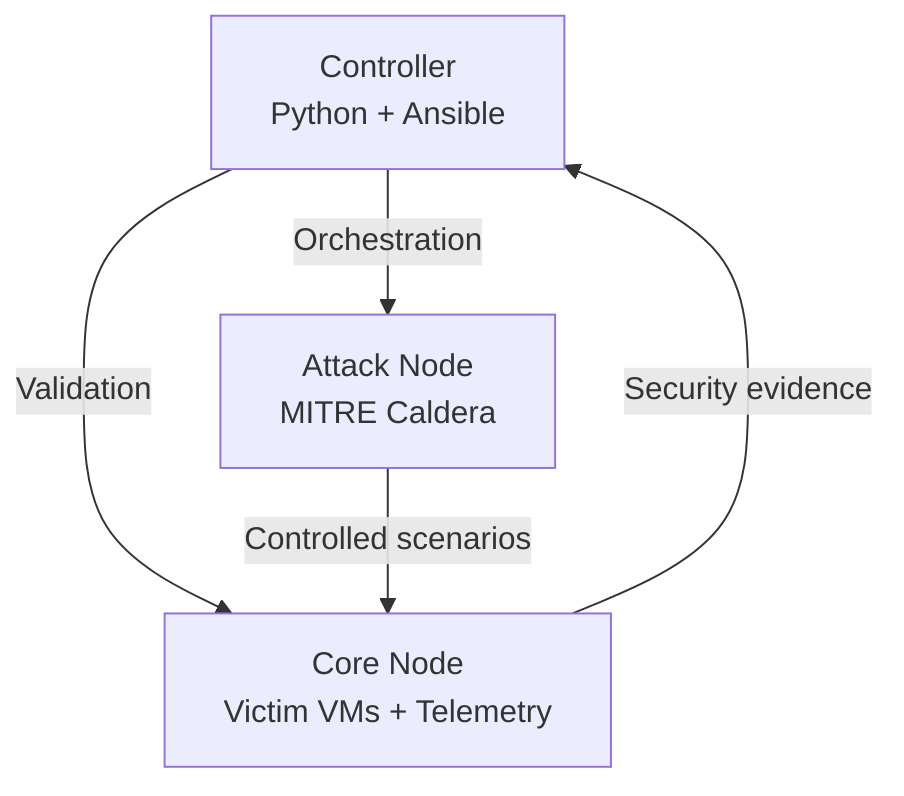

# Sapphros Threat-Informed Attack Validation

A Python and Ansible security validation lab that maps controlled adversary
emulation to defensive telemetry, Sigma detections, automated validation, and
repeatable PASS/FAIL reporting.

This project is being developed as a practical demonstration of detection
engineering, cybersecurity automation, adversary emulation, and technical
documentation.

## Project Goals

- Execute controlled MITRE ATT&CK scenarios in an isolated homelab
- Collect endpoint and network telemetry
- Develop and test Sigma detection rules
- Validate expected security events with Python
- Produce repeatable PASS/FAIL evidence
- Generate ATT&CK coverage reports suitable for portfolio review

## Architecture



| System | Hostname | Function |
|---|---|---|
| Controller | `sapphros-controller` | Orchestration, validation, and reporting |
| Attack node | `sapphros-attack` | Controlled adversary emulation |
| Core node | `sapphros-core` | Virtualization, victim systems, and telemetry |

## Current Capabilities

- Passwordless controller-to-node SSH authentication
- Ansible inventory and centralized orchestration
- Automated operating-system and resource validation
- Machine-readable JSON evidence collection
- Python PASS/FAIL validation
- Automated unit testing with pytest

## Validation Pipeline

```text
Ansible health check
        ↓
JSON host evidence
        ↓
Python validation
        ↓
PASS/FAIL result
        ↓
Future ATT&CK coverage report
```

## Current Results

| Validation target | Result |
|---|---|
| Attack node connectivity | PASS |
| Core node connectivity | PASS |
| Ubuntu baseline | PASS |
| Attack node resource baseline | PASS |
| Core node resource baseline | PASS |
| Python unit tests | 4 PASSED |

## Detection Validation Results

The first closed-loop ATT&CK adversary emulation exercise ran three
techniques against `win-target-01` via Caldera. Full write-up:
[docs/detection-validation-001.md](docs/detection-validation-001.md).

| Technique | Tactic | Result |
|---|---|---|
| T1547.001 – Registry Run Keys | Persistence | Detected |
| T1003.001 – LSASS Memory (comsvcs.dll) | Credential Access | Prevented (Defender), rule tuned to remove false positive |
| T1070.004 – File Deletion | Defense Evasion | Detected |

Scenario definition: [scenarios/sapphros-detection-validation-v1.yml](scenarios/sapphros-detection-validation-v1.yml)
Sigma rules: [detections/sigma/](detections/sigma/)
Raw evidence: [reports/operations/sapphros-detection-validation-v1.json](reports/operations/sapphros-detection-validation-v1.json)

## Running the Baseline Validation

Activate the Python environment:

```bash
source .venv/bin/activate
```

Collect current host evidence:

```bash
ansible-playbook ansible/playbooks/health_check.yml
```

Run the Python validator:

```bash
sapphros-validate
```

Run the automated tests:

```bash
pytest -v
```

## Repository Structure

```text
sapphros-attack-validation/
├── ansible/
│   ├── inventory/
│   ├── playbooks/
│   └── roles/
├── detections/
│   └── sigma/
├── docs/
├── reports/
│   └── hosts/
├── scenarios/
├── src/
│   └── sapphros_validator/
├── tests/
├── ansible.cfg
├── pyproject.toml
└── README.md
```

## Safety and Scope

This project is restricted to systems owned and controlled by the project
author. Adversary-emulation activities are executed only inside the isolated
Sapphros homelab for defensive research, detection validation, and education.

No production systems or third-party systems are targeted.

## Roadmap

- Deploy isolated Windows and Linux victim machines
- Configure Sysmon and centralized event collection
- Integrate MITRE Caldera
- Define YAML-based ATT&CK validation scenarios
- Develop custom Sigma detections
- Correlate scenario execution with collected telemetry
- Generate automated ATT&CK coverage reports
- Add continuous integration through GitHub Actions
- Publish sanitized project results on Sapphros.com
