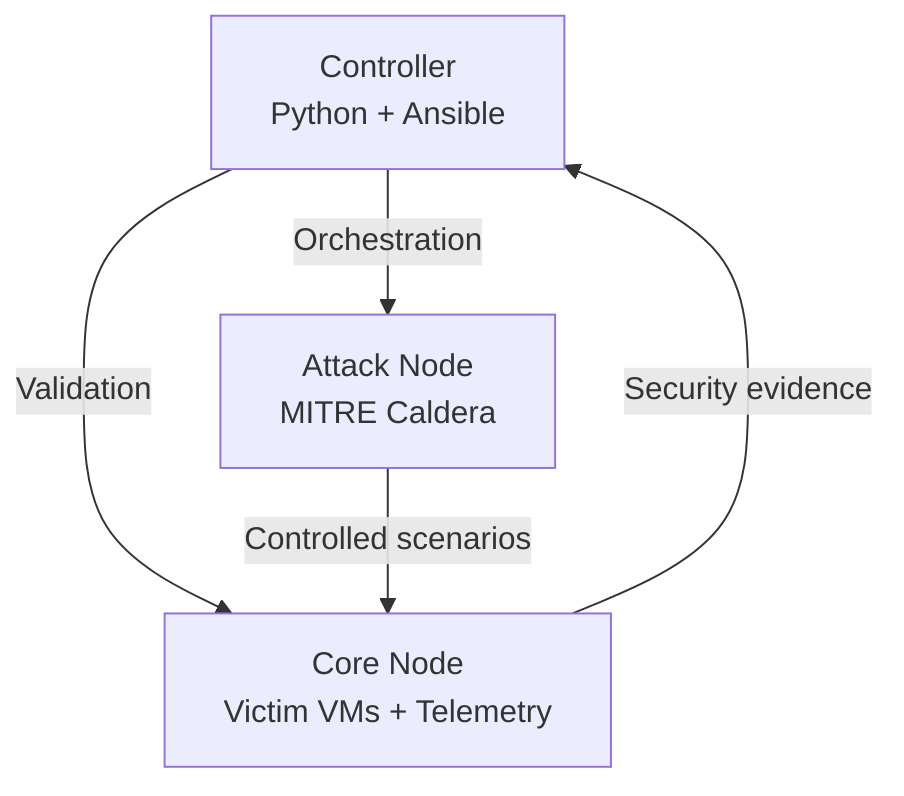

# Sapphros Threat-Informed Attack Validation

I built this Python and Ansible security validation lab to map controlled adversary
emulation with defensive telemetry, Sigma detections, repeatable validation, and
documented security findings.

This project is being developed as a practical demonstration of detection
engineering, cybersecurity automation, adversary emulation, and technical
documentation.

## Project Goals

- Execute controlled MITRE ATT&CK scenarios in an isolated homelab
- Collect and analyze endpoint and network telemetry
- Develop and test Sigma detection rules
- Automate repeatable validation where practical
- Preserve machine-readable evidence and reproducible scenario definitions
- Generate ATT&CK coverage reports suitable for portfolio review

## Architecture



| System | Hostname | Function |
|---|---|---|
| Controller | `sapphros-controller` | Orchestration, validation, and reporting |
| Attack node | `sapphros-attack` | Controlled adversary emulation |
| Core node | `sapphros-core` | Virtualization, victim systems, and telemetry |

## Current Capabilities

### Infrastructure and Orchestration

- Passwordless controller-to-node SSH authentication
- Ansible inventory and centralized orchestration
- Isolated Windows victim environment for controlled adversary emulation
- MITRE Caldera attack platform integration
- Sysmon telemetry configuration for Windows security events
- YAML-based ATT&CK scenario definitions

### Automated Baseline Validation

- Ansible collection of operating-system and resource evidence
- Machine-readable JSON host reports
- Python PASS/FAIL validation of host baselines
- Automated unit testing with pytest
- GitHub Actions CI across Python 3.12, 3.13, and 3.14
- Ruff linting and validation executed on repository changes

The current Python validator evaluates host configuration and resource
baselines. It does **not yet** automatically score Caldera operations against
Sigma detections or ATT&CK coverage.

### Detection Validation and Analysis

- Controlled ATT&CK technique execution through MITRE Caldera
- Correlation of Caldera activity with Sysmon and Microsoft Defender evidence
- Custom Sigma detection development and tuning
- Preservation of raw operation evidence
- Documented detection-engineering findings and lessons learned

Detection-validation outcomes are currently determined from preserved
telemetry and operation evidence, then documented in the scenario and
write-up. Automating this attack-to-detection correlation and scoring is a
planned next step.

## Baseline Validation Pipeline

The host-baseline workflow is automated:

```text
Ansible health check
        ↓
JSON host evidence
        ↓
Python validation
        ↓
PASS/FAIL result
        ↓
GitHub Actions / local test output
```

## Detection Validation Workflow

The current detection-engineering workflow is implemented and evidence-driven:

```text
MITRE Caldera ATT&CK scenario
        ↓
Windows target execution / prevention
        ↓
Sysmon + Defender telemetry
        ↓
Evidence review and correlation
        ↓
Sigma detection validation / tuning
        ↓
Documented DETECTED or PREVENTED outcome
```

## Current Results

| Validation target | Result |
|---|---|
| Attack node connectivity | PASS |
| Core node connectivity | PASS |
| Ubuntu baseline | PASS |
| Attack node resource baseline | PASS |
| Core node resource baseline | PASS |
| Python unit tests | 4 PASSED |
| GitHub Actions CI | PASS |

## Detection Validation Results

The first closed-loop ATT&CK adversary emulation exercise ran three
techniques against `win-target-01` via Caldera. Full write-up:
[docs/detection-validation-001.md](docs/detection-validation-001.md).

| Technique | Tactic | Result |
|---|---|---|
| T1547.001 – Registry Run Keys | Persistence | Detected |
| T1003.001 – LSASS Memory (comsvcs.dll) | Credential Access | Prevented (Defender), rule tuned to remove false positive |
| T1070.004 – File Deletion | Defense Evasion | Detected |

Scenario definition:
[scenarios/sapphros-detection-validation-v1.yml](scenarios/sapphros-detection-validation-v1.yml)

Sigma rules:
[detections/sigma/](detections/sigma/)

Raw evidence:
[reports/operations/sapphros-detection-validation-v1.json](reports/operations/sapphros-detection-validation-v1.json)

### Detection-Engineering Finding

During T1003.001 validation, Defender prevented the simulated
`rundll32.exe` / `comsvcs.dll` LSASS dump before the attacker process
generated the expected Sysmon telemetry. Sysmon ProcessAccess events in the
same window were instead generated by Defender's own `MsMpEng.exe` process.

A source-process-blind LSASS rule could therefore have misclassified Defender
remediation activity as attacker activity. The Sigma rule was tuned to exclude
Defender's own process, and the exercise was recorded as **PREVENTED** rather
than incorrectly scored as **DETECTED**.

## Running the Baseline Validation

Activate the Python environment:

```bash
source .venv/bin/activate
```

Collect current host evidence:

```bash
ansible-playbook ansible/playbooks/health_check.yml
```

Run the Python validator:

```bash
sapphros-validate
```

Run the automated tests:

```bash
pytest -v
```

## Repository Structure

```text
sapphros-attack-validation/
├── .github/
│   └── workflows/
├── ansible/
│   ├── inventory/
│   ├── playbooks/
│   └── roles/
├── configs/
│   └── sysmon/
├── detections/
│   └── sigma/
├── docs/
├── reports/
│   ├── hosts/
│   └── operations/
├── scenarios/
├── src/
│   └── sapphros_validator/
├── tests/
├── ansible.cfg
├── pyproject.toml
└── README.md
```

## Safety and Scope

This project is restricted to systems owned and controlled by me, the project
author. Adversary-emulation activities are executed only inside the isolated
Sapphros homelab for defensive research, detection validation, and education.

No production systems or third-party systems are targeted.

## Roadmap

- Automate correlation between Caldera operations and collected security telemetry
- Add automated DETECTED / PREVENTED / NOT DETECTED outcome scoring
- Generate ATT&CK technique-coverage reports from validation results
- Expand Windows and Linux victim coverage
- Centralize and normalize telemetry collection across lab targets
- Add additional ATT&CK validation scenarios and Sigma detections
- Publish sanitized project results on Sapphros.com
